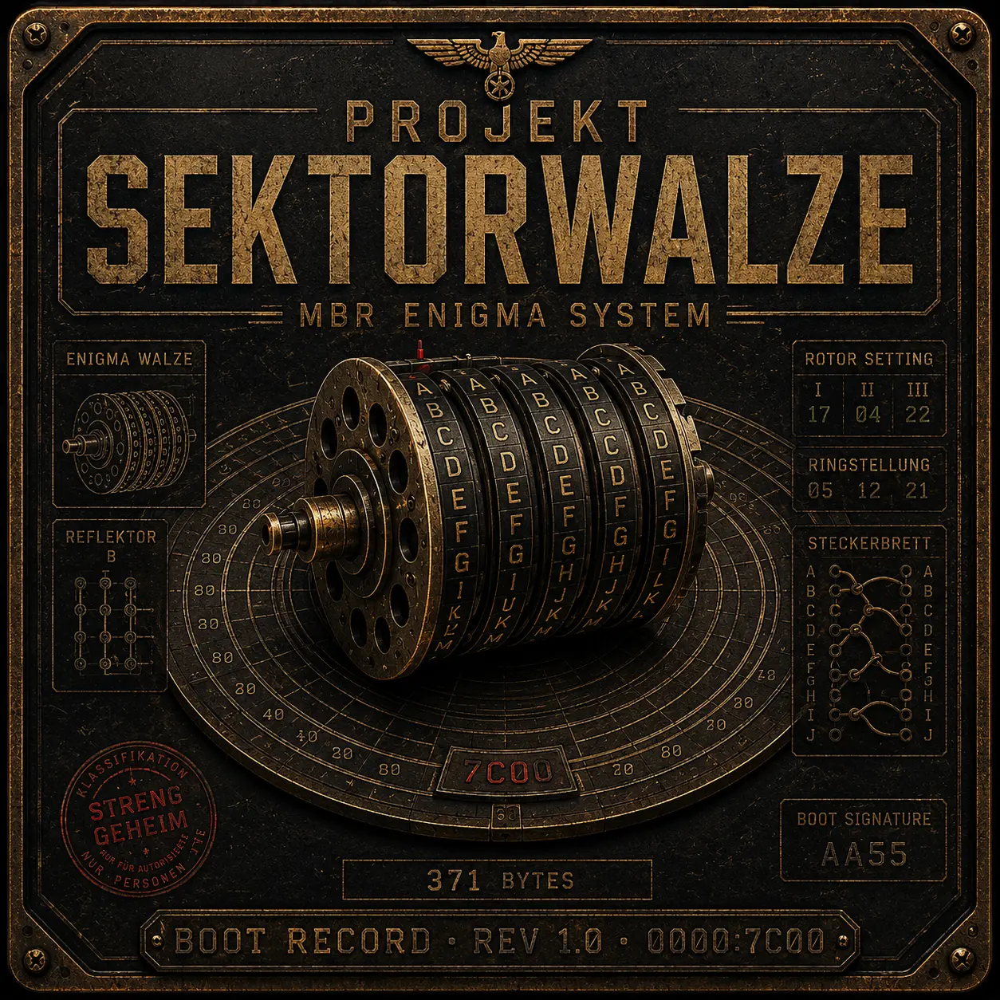

# Projekt Sektorwalze

This is a project for [The Paper Enigma](https://mckoss.com/posts/paper-enigma/) English version. Written in x86_16 Assembly for a 512 byte Bootsector.

The Enigma itself has a size of **371 bytes** and just for fun wasted 138 bytes on some beeping sounds.

Have fun with the Project it works on USB and ISO but only Legacy boot systems can load it because of the MBR nature of this project.
